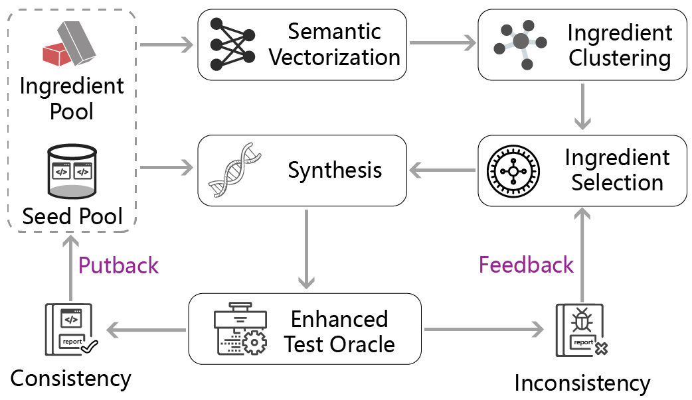
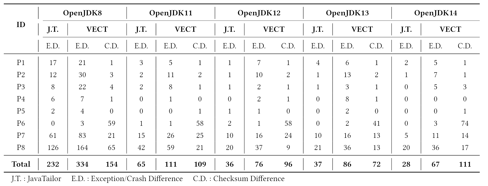

### VECT

This is the implementation of our ISSTA 2023 paper: Vectorizing Program Ingredients for Better JVM Testing.

### I. Introduction

The existing synthesis-based JVM testing work puts more efforts in ensuring the validity of synthesized test programs, but ignores the influence of huge ingredient space, which largely limits the ingredient exploration efficiency as well as JVM testing performance. In this work, we propose Vectorized JVM Testing (called VECT) to further promote the performance of synthesis-based JVM testing. 

Figure 1 shows the overview of VECT.  It first vectorizes the semantics of ingredients through code representation, and then clusters the ingredients with similar semantics into the same group, which can largely reduce the search space for ingredient selection. Next, VECT gradually learns which groups of ingredients should be selected with higher probabilities based on the group selection history and the testing results of generated test programs during the testing process. It can help guide the subsequent ingredient selections in order to achieve better testing performance. Finally, VECT designs an enhanced test oracle through monitoring the results of various intermediate variables in order to capture the JVM bugs triggered by the synthesized test programs more sufficiently.



<p align="center">Figure 1: Overview of VECT</p>

To evaluate the effectiveness of VECT, we conducted an extensive study on three popular JVM implementations (i.e., HotSpot, OpenJ9, and Bisheng) involving five OpenJDK versions. The experimental results show that VECT can detect more unique inconsistencies than the state-of-the-art synthesis-based JVM testing technique (i.e., JavaTailor) during the same testing time, achieving 110.34%∼535.71% improvements across all the OpenJDK versions. Table 1 shows the experimental results of VECT.

<p align="center">Table 1: Comparison results of JavaTailor and VECT in terms of the number of</p>



### II. Preparation Work

##### 1: Import as an maven project

VECT is developed as an maven project, so you can directly load the project using IntelliJ IDEA workspace to build the environment.

##### 2: Download test subjects

We do not provide test subjects in this repo, so you need to download the corresponding JVM. Please place your test subjects in the following format.

```
├── 01JVMS
│   ├── Windows
│   |   ├── openjdk8
│   |   │   ├── hotspot_8  // including bin folder
│   |   │   └── openj9_8   
│   |   ├── openjdk11
│   |   │   ├── hotspot_11  
│   |   │   └── openj9_11 
│   |   ├── openjdk12
│   |   ├── openjdk13
│   |   └── openjdk14
│   ├── linux64
└── └── macOSx64
```

##### 3: Create sootOuput directory

In order to not break the original benchmark content, we use a copy of them for synthetic. Please create **sootOuput** directory and copy  all items under **02Benchmarks** to **sootOuput**

##### 4: test

You can get the execution information directly by executing **Preview** under **Main/src/main/java**.

execution environment

```
============================================ Testing Platform Information ============================================
     os name: windows 10
  os version: 10.0
   java home: yourpath
java version: 11.0.14.1
======================================================================================================================
```

JVM subjects information

```
================================================= JVM Implementation =================================================
JVM root path: .\01JVMS\Windows\openjdk8
  JVM Version: openjdk8
     Java Cmd: yourpath\.\01JVMS\Windows\openjdk8\jdk_win_8_hotspot\bin\java.exe
======================================================================================================================
================================================= JVM Implementation =================================================
JVM root path: .\01JVMS\Windows\openjdk8
  JVM Version: openjdk8
     Java Cmd: yourpath\.\01JVMS\Windows\openjdk8\jdk_win_8_openj9\bin\java.exe
======================================================================================================================
```

test benchmarks infromation

```
================================================= Project Information =================================================
Project Path: yourpath/02Benchmarks/HotspotTests-Java
Project Name: HotspotTests-Java
         lib: yourpath/02Benchmarks/HotspotTests-Java/lib
         src: yourpath/02Benchmarks/HotspotTests-Java/src
   total src: 8856
        test: null
  total test: 0
   src class: yourpath/02Benchmarks/HotspotTests-Java/out/production/HotspotTests-Java
  test class: null
 applicaiton: 3986/12134
 junit class: 26/0
=======================================================================================================================
```

### III. Getting Started

We provide the source files and jar packages for the project. You can make changes in the source code, or just use the jar to execute the project directly. Please set the -help parameter to get our help document.

### IV. Directory description

```markdown
├── 01JVMS                      :  test subjects
├── 02Benchmarks                :  origin benchmarks
├── 03results                   :  difference report
├── 04SynthesisHistory          :  programs generated during synthsizing 
├── DTJVM                       :  Execution Phase Module
├── JavaTailor                  :  Synthesis Phase Module
├── Main                        :  Control Module
└── sootOutput                  :  benchmarks for synthesized
```

