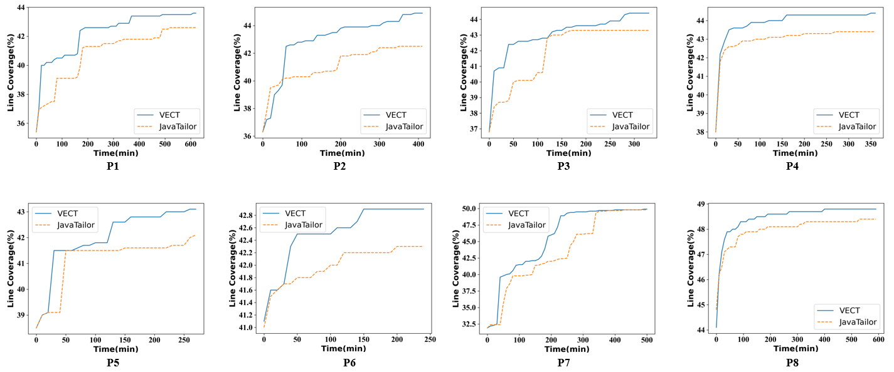

Figure 1: Line coverage trend on benchmarks P1-P8

To better answer RQ3, we analyzed the coverage growth trend with the testing process proceeding on each benchmark. Figure 1 shows the results, where the x-axis of each sub-figure represents the testing time while the y-axis represents the achieved line coverage. 

The conclusions from all the sub-figures are almost consistent. Except at the very early stage, VECT always achieves higher JVM line coverage than JavaTailor, and the superiority of VECT becomes more obvious later. This is because at the very early stage, the feedback-driven ingredient selection strategy does not learn too much for guiding the testing process. With the testing process proceeding, this strategy can receive more and more feedback and meanwhile the superiority of the reduced ingredient space becomes obvious, and thus VECT achieves better results in terms of JVM line coverage accordingly. That demonstrates the high efficiency of VECT. 

We notice that on P7, both VECT and JavaTailor achieve similar line coverage in the final stage. This is because both the ingredient pool and the seed programs are from the same test programs (i.e., P7), which can lead to small coverage increments of synthesis-based JVM testing over the seed programs (confirmed by the JavaTailor work). Moreover, the testing time on P7 is relatively long (i.e., 3 days), and thus each seed program in the benchmark is very likely to be used at least once within the testing time. This causes regardless of JavaTailor or VECT, the achieved line coverage in the final stage is similar to that achieved by the set of seed programs.
